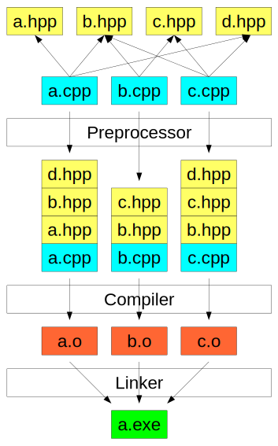

# Introduction to C++

## C++ Core Guidelines

The [C++ Core Guidelines](https://github.com/isocpp/CppCoreGuidelines) are a set of best practices, recommendations, and rules for coding in C++ which have been developed by Bjarne Stroustrup and hundreds of other experts in the field. These guidelines are an important part of the language, as they help users to write the best, most up-to-date C++ possible. In the next couple of videos, Bjarne will talk about the origin of the guidelines and give some advice on how to use them.

## Standard Library

"The C++ Standard Library is a collection of classes and functions, which are written in the core language and part of the C++ ISO Standard itself." Wikipedia

Learning how to use the Standard Library is an important part of becoming a proficient C++ software engineer. In almost all cases, it is preferable to utilize functionality that already exists in the Standard Library, instead of implementing functionality from scratch. This is both because using the Standard Library is faster (it is [well-documented](http://www.cplusplus.com/reference/)) and because many expert software engineers have worked on the Standard Library. The performance of Standard Library facilities is optimized, robust, and almost always as fast or faster than an initial re-implementation of the same functionality.

In fact, guideline [SL.1](http://isocpp.github.io/CppCoreGuidelines/CppCoreGuidelines#sl1--use-libraries-wherever-possible) of the [C++ Core Guidelines](http://isocpp.github.io/CppCoreGuidelines/CppCoreGuidelines) is:

Use libraries wherever possible

Reason Save time. Don’t re-invent the wheel. Don’t replicate the work of others. Benefit from other people’s work when they make improvements. Help other people when you make improvements.

And guideline [SL.2](http://isocpp.github.io/CppCoreGuidelines/CppCoreGuidelines#sl2-prefer-the-standard-library-to-other-libraries) is:

Prefer the standard library to other libraries

Reason More people know the standard library. It is more likely to be stable, well-maintained, and widely available than your own code or most other libraries.

We use Standard Library features throughout the program, since proficiency with the Standard Library is a critical for C++ developers.

Namespace
Standard Library functions and classes exist in the std:: namespace. std::vector, for example, refers to the vector class within the Standard Library. Typically, in order to use a Standard Library feature we must both include the necessary header file (e.g. #include <vector>) and also namespace the class with std:: (e.g. std::vector).

## Compilation

Compilers
C++ is a compiled programming language, which means that programmers use a program to compile their human-readable source code into machine-readable [object](https://en.wikipedia.org/wiki/Object_file) and [executable](https://en.wikipedia.org/wiki/Executable) files. The program that performs this task is called a [compiler](https://en.wikipedia.org/wiki/Compiler).

C++ does not have an "official" compiler. Instead, there are [many different compilers](http://www.stroustrup.com/compilers.html) that a programmer can use.

GNU Compiler Collection (GCC)
In this program we primarily use the [GNU Compiler Collection](https://gcc.gnu.org/), which is a popular, open-source, cross-platform compiler from the larger [GNU Project](https://www.gnu.org/gnu/thegnuproject.en.html). In particular, we use the g++ program, which is a command line executable that compiles C++ source code and automatically [links](https://en.wikipedia.org/wiki/Linker_(computing%29) the C++ [Standard Library](http://www.cplusplus.com/reference/).

## Linking
C++ Compilation Process Diagram

C++ Compilation Process (Wikimedia)

In order to use classes and functions from the [C++ Standard Library](http://www.cplusplus.com/reference/), the compiler must have access to a compiled version of the standard library, stored in object files. Most compiler implementations, including GCC, include those object files as part of the installation process. In order to use the Standard Library facilities, the compiler must "link" the standard library object files to the object files created from the programmer's source code.

Once the compiler links together the necessary object files, it is able to generate a standalone executable file that can run on the operating system.

## Build Tools
[Make](https://www.gnu.org/software/make/manual/html_node/index.html#Top) and [CMake](https://cmake.org/) are two separate and similar build tools that both serve to help simplify the process of [building](https://en.wikipedia.org/wiki/Software_build) software.

In particular, build tools automate the process of compiling multiple source code files into object files, linking those object files together, and generating an executable. Build tools also often automate the process of determining which files have changed since the last build and thus need to be recompiled.

C++ Build Process Diagram: Preprocessing, Compiling, Linking
C++ Build Process

### Make
GNU Make is a widely-used build tool that relies on Makefiles to automate the process of building a project.

A Makefile typically includes one or more "targets". Each target performs a different action.

build is a common target name that is configured in the Makefile to compile all of the project's source code into an executable file. clean, on the other hand, is a common target to delete all object files and other artifacts of the build process, resulting in a clean, unbuilt project state.

Running either make build or make clean (or any other target) on the command line would cause Make to search for a local Makefile, search for a matching target within that Makefile, and then execute the target.

GNU provides

### CMake
CMake is a built tool that facilitates cross-platform builds, so that it is straightforward to build the same source code on Linux, macOS, Windows, or any other operating system. CMake relies on a CMakeLists.txt file, which configures appropriate cross-platform targets.

Building a CMakeLists.txt file can be a bit daunting, but CMake provides a helpful [tutorial](https://cmake.org/cmake-tutorial/).

In this Nanodegree program, you will not need to build your own Makefiles or CMakeLists.txt files. We provide the appropriate configuration files for each project and instruct you as to their usage.